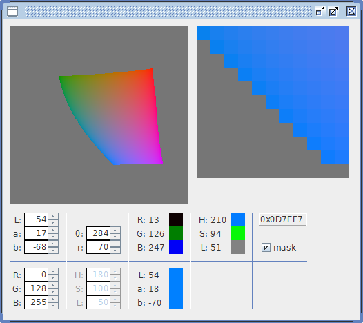

# LabColorPicker

It all started when I wanted to pick some colors for my personal syntax highlighting theme. It always bothered me that the color yellow was much brighter than the other colors, and trying to paint several things of different colors always had the problem of what to do with yellow. So I started investigating. In fact, if it weren't for a Mechatronics Technician degree I got in a trade school, I would have became a (graphic/web) designer, so colors and related stuff are fields I always had and still have interest it, and I learned quite a bit by my own.

For example, I learned about the difference in lightness in colors that have the same intensity in the [RGB](https://en.wikipedia.org/wiki/RGB_color_model) model. Consider the following image:

These colors are at max intensity in RGB (except for black, of course). But you can see that yellow looks much brigher/lighter than blue. If you use [GIMP](https://en.wikipedia.org/wiki/GIMP) and desaturate this image, you get a choice between Lightness and Luminosity. If you pick the first one, you get:

You can see that all colors are at max intensity, according to RGB. But if you pick Luminosity instead, you get:

So you can see that yellow indeed appears brighter/lighter than blue to our eyes. With that in mind, I wanted a color model where you had a component that represented lightness, like [HSL](https://en.wikipedia.org/wiki/HSL_and_HSV) (which I already used), but where this lightness was adjusted to how we perceive it, and I found [CIELAB](https://en.wikipedia.org/wiki/Lab_color_space).

This program was made when I wasn't as experienced in Java as I'm now, and it even have some unimplemented features, but I've used it extensively to pick colors and it have served me well, and that's why I decided to share it as it is. I intend to make a new one someday, one that can also use other models like [CIEXYZ](https://en.wikipedia.org/wiki/CIE_1931_color_space) and [YUV](https://en.wikipedia.org/wiki/YUV), but that will take a long time.

Anyway, here's what it looks like:

The **L**, **a** and **b** spinners let you choose the L&ast;a&ast;b&ast; components to be transformed to RGB and HSL. The image on the left shows all colors for the selected **L&ast;**, with **a&ast;** varying from negative on the left to positive on the right, and **b&ast;** varying from negative below to positive above. Clicking on this image shows it zoomed on the right, in a 11&nbsp;×&nbsp;11 grid, where the middle "pixel" is the point you clicked. Every "pixel" is about 1 **a&ast;** or **b&ast;** unit, varying from −128 to +128.

The **θ** and **r** spinners let you choose a point in polar coordinates. The **L&ast;** is the same as the one in its spinner, and **a&ast;** and **b&ast;** are calculated from the polar coordinates, centered on (**a&ast;**;**b&ast;**)&nbsp;=&nbsp;(0;0), which is always gray.

The **R**, **G** and **B** fields show the selected L&ast;a&ast;b&ast; color in RGB, with a square colored from black to that component's maximum intensity. Same thing for the **H**, **S** and **L** fields, except that the **H** field varies between 0° and 360° and shows a color with (S;L)&nbsp;=&nbsp;(100%;&nbsp;50%) at the calculated hue; the **S** and **L** fields vary from 0% to 100%; the **S** field shows a color with (H;L)&nbsp;=&nbsp;(120°;&nbsp;50%) at the calculated saturation; and the **L** fields vary between black and white.

There's also a field with the hex triplet for the color, and a checkbox that controls the hiding of invalid colors. Unchecking it leads to trippy and interesting results.

The **R**, **G** and **B** spinners calculate a color from RGB to L&ast;a&ast;b&ast; and show them in the **L**, **a** and **b** fields. The **H**, **S** and **L** spinners should have done the same, but weren't implemented.

I copied the source files into a new NetBeans project because the old project had some problems that couldn't had been solved otherwise. I also added the `static` block to improve the look and feel, and copied the source for the `WritableRaster` class, which was a library and an earlier version of my `ImageComponent`.

All math methods use code I optimized from [EasyRGB](http://www.easyrgb.com/index.php?X=MATH), so thanks for that!
